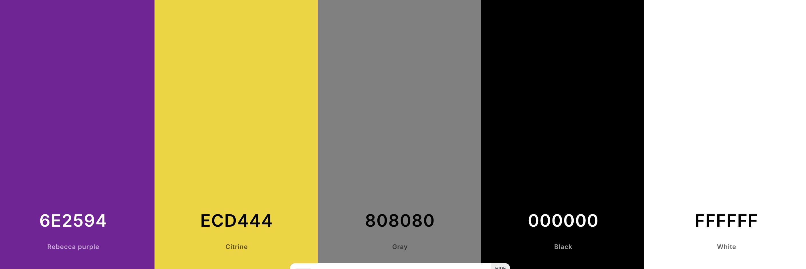

_This journal is a record of all the steps
I've taken in the development of 
VersionCollab._
# 2024
## November
### Friday, November 22, 2024
I started planning the MVP and beyond for 
VersionCollab. The MVP will have the 
following features:
* User registration
* User login
* Project creation
* Document creation
* File upload
* File commenting, to include nested comments

Technology used:
* Front-end: React, Bootstrap
* Back-end: Python, FastAPI, PostgresSQL, Node

Tasks completed today:
* Setup project in Python
* Installed FastAPI
* Started coding user registration and login

**Notes:** Completed the day's back-end 
development with some lingering errors 
with the running of the web server (Uvicorn).
To be resolved tomorrow.
### Saturday, November 23, 2024
Today, I set up a relational database in
Postgres for the MVP. The following 
tables have been set up:
* Users
* Projects — container to host big-picture projects
* Documents — container that tracks versions of each document within the project
* Files — tracks single uploads to specific documents within the project
* Comments — users can comment on specific files and reply to comments

I will be testing the database to ensure 
this is the best state of the MVP data.

Back-end development tasks completed:
* Resolved uvicorn exceptions from 11-22-24
* Resolved exceptions with Alembic after initializing for database migrations
* Resolved errors with password hashing by removing outdated frameworks (passlib replaced with crypotography)
* Tested user registration and login
* Started coding CRUD operations for projects route
* Create private git repository for back-end code (will add front-end code to its own public repository)

To prepare for front-end development in 
the next state of the MVP, I also did some
work in diving deeper into coding with 
React.

Back-end tasks for tomorrow:
* Continue developing projects route for all CRUD operations
* Develop documents route for CRUD operations
* Develop files route for CRUD operations
* Develop comments route for CRUD operations
* Test completed routes and make notes on any errors or improvements that need attention

Since I am not in the front-end development
stage yet, I will focus my front-end dev 
time today on CSS color schemes and 
designing wireframes in Figma. I believe 
I also have an old logo I created that 
I need to hunt down and see if it's still 
viable for this project.

Thoughts on timeline for this stage:

* I think I'm on track to getting the back-end CRUD at least 50% completed this week
* The errors from yesterday/today did take quite some time to fix, but I still feel like I'm on track

Wireframes to work on today:

* Home page [logged out] **done**
* Home page [logged in] **done**
* Sign-up page **done**
* Login page **done**
* Dashboard home **done**
* Create project **done**
* List projects
* View project
* Add document
* List documents
* View document
* Upload file
* List files
* Download file

Color Scheme:

CSS colors: [light]
* Background: #FFFFFF
* On-Background: #000000
* Primary: #6E2594
* Secondary: #ECD444
* Neutral: #808080

CSS colors: [dark] 
* Background: #000000
* On-Background: #FFFFFF
* Primary: #ECD444
* Secondary: #A076B6
* Neutral: #808080